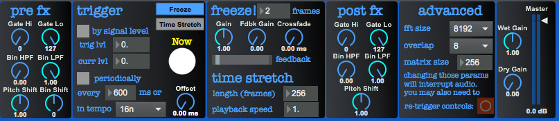

# max-mik.freeze

Pfft-based live-oriented freeze and time stretcher

## Features:
* Pre FX – basic spectral effects
 * Gate Hi/Gate Lo – spetral gate and (de)noiser, filters out bins with signal intensity outside of the defined band.
 * Bin LPF/Bin HPF – spectral band pass filter – silences bins by bin their number
 * Pitch Shift – sets the transposition of a gizmo~ pitch shifter, 1 = no transposition.
 * Bin shift – Shifts the spectral data by up to 64 samples upwards or by up to 63 samples downwards.
* Trigger
 * This section can either trigger the freeze or the time stretch/phase vocoder parts of this patch
 * “By signal level” – switches on/off the peak trigger, which sends a trigger signal according to Trig lvl.
 * Trig lvl – Sets the threshold which send a trigger signal when input level surpasses this value.
 * Curr lvl – read-only field showing current input level for reference.
 * “Periodically” – switches on/off periodic triggers based on the settings below.
   The first one, a number bow, sets the number of milliseconds between the triggers, the lower select box allows triggers to be synchronized to a global transport. This unfortunately only sets the tempo, but does not necessarily work in sync with the global transport. Those two are mutually exclusive and the one which is changed last is used.
 * Offset – allows the periodic trigger signal to be delayed by up to 255ms.
     
* Freeze
 * “frames” – sets how many frames (jitter.matrix rows) will be used for storing the frozen spectral information. (Set to higher values for echo-like sound together with proper feedback settings.)
 * Gain – changes the volume of the sound input to the “freeze circuit”.
 * Fdbk Gain – Allows frozen signal to be fed back into the “freeze circuit” for echo and reverb-like effects. (Also makes a good “sound accumulator” with Fdbk Gain = 1, Gain ~ 0.1)
 * Crossfade – If more than one frame is used for freezing, this sets the time it takes to continuously interpolate between the current and the previous frozen frames. (Makes a nice reverb-like sound, too)
* Time stretch
 * Length (frames) – Sets the length of the segment of incoming signal that will be recorded to the jitter matrix are played back in a loop with variable speed.
 * Playback speed – Sets the playback speed of a recorded loop.
* Post FX
 * Spectral gates, filters and gizmo~ pitch shifter like in Pre FX, no bin shift.
* Advanced
 * FFT size and overlap selection, discards previous audio
 * Matrix size – sets one dimension of the matrix used to store spectral data, the other dimension is determined by FFT size. Sets an upper limit on “# of frames” and “length (frames)” fields.
 * Retrigger all knobs – the magic button used to fix unexpected behaviour, occurring mostly after changing FFT settings.
* Wet/Dry gain & Master volume

## Known bugs
* Sometimes, controls need to be retriggered after changing FFT settings, no sound comes out otherwise.
* The time stretching part tends to need a few triggers before it starts working properly when used for the first time or after FFT settings have been changed.
